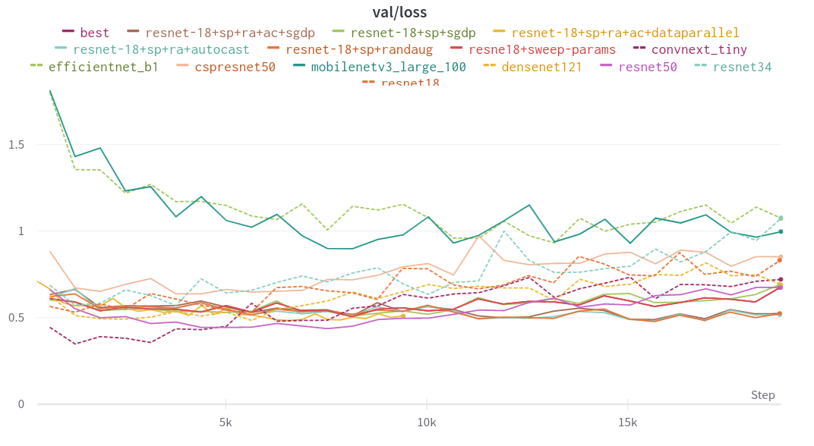
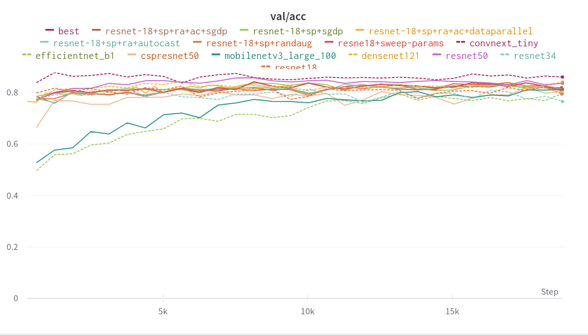
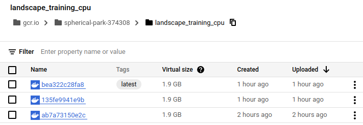
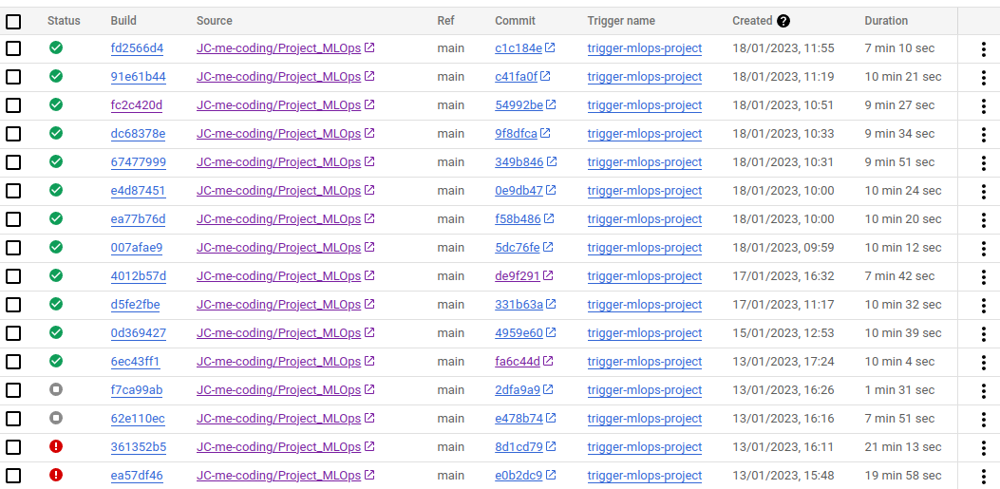

# Exam template for 02476 Machine Learning Operations

This is the report template for the exam. Please only remove the text formatted as with three dashes in front and behind
like:

```--- question 1 fill here ---```

where you instead should add your answers. Any other changes may have unwanted consequences when your report is auto
generated in the end of the course. For questions where you are asked to include images, start by adding the image to
the `figures` subfolder (please only use `.png`, `.jpg` or `.jpeg`) and then add the following code in your answer:

```markdown

```

In addition to this markdown file, we also provide the `report.py` script that provides two utility functions:

Running:

```bash
python report.py html
```

will generate an `.html` page of your report. After deadline for answering this template, we will autoscrape
everything in this `reports` folder and then use this utility to generate an `.html` page that will be your serve
as your final handin.

Running

```bash
python report.py check
```

will check your answers in this template against the constrains listed for each question e.g. is your answer too
short, too long, have you included an image when asked to.

For both functions to work it is important that you do not rename anything. The script have two dependencies that can
be installed with `pip install click markdown`.

## Overall project checklist

The checklist is *exhaustic* which means that it includes everything that you could possible do on the project in
relation the curricilum in this course. Therefore, we do not expect at all that you have checked of all boxes at the
end of the project.

### Week 1

* [x] Create a git repository
* [x] Make sure that all team members have write access to the github repository
* [x] Create a dedicated environment for you project to keep track of your packages
* [x] Create the initial file structure using cookiecutter
* [x] Fill out the `make_dataset.py` file such that it downloads whatever data you need and
* [x] Add a model file and a training script and get that running
* [x] Remember to fill out the `requirements.txt` file with whatever dependencies that you are using
* [ ] Remember to comply with good coding practices (`pep8`) while doing the project
* [ ] Do a bit of code typing and remember to document essential parts of your code
* [x] Setup version control for your data or part of your data
* [x] Construct one or multiple docker files for your code
* [x] Build the docker files locally and make sure they work as intended
* [x] Write one or multiple configurations files for your experiments
* [x] Used Hydra to load the configurations and manage your hyperparameters
* [ ] When you have something that works somewhat, remember at some point to to some profiling and see if
      you can optimize your code
* [x] Use Weights & Biases to log training progress and other important metrics/artifacts in your code. Additionally,
      consider running a hyperparameter optimization sweep.
* [ ] Use Pytorch-lightning (if applicable) to reduce the amount of boilerplate in your code

### Week 2

* [x] Write unit tests related to the data part of your code
* [x] Write unit tests related to model construction and or model training
* [x] Calculate the coverage.
* [x] Get some continuous integration running on the github repository
* [x] Create a data storage in GCP Bucket for you data and preferable link this with your data version control setup
* [x] Create a trigger workflow for automatically building your docker images
* [x] Get your model training in GCP using either the Engine or Vertex AI
* [x] Create a FastAPI application that can do inference using your model
* [ ] If applicable, consider deploying the model locally using torchserve
* [x] Deploy your model in GCP using either Functions or Run as the backend

### Week 3

* [ ] Check how robust your model is towards data drifting
* [ ] Setup monitoring for the system telemetry of your deployed model
* [ ] Setup monitoring for the performance of your deployed model
* [x] If applicable, play around with distributed data loading
* [ ] If applicable, play around with distributed model training
* [ ] Play around with quantization, compilation and pruning for you trained models to increase inference speed

### Additional

* [ ] Revisit your initial project description. Did the project turn out as you wanted?
* [x] Make sure all group members have a understanding about all parts of the project
* [x] Uploaded all your code to github


## Group information

### Question 1
> **Enter the group number you signed up on <learn.inside.dtu.dk>**
>
> Answer:

19

### Question 2
> **Enter the study number for each member in the group**
>
> Example:
>
> *sXXXXXX, sXXXXXX, sXXXXXX*
>
> Answer:

s123540, s183527, s222675, ronjag, dimara

### Question 3
> **What framework did you choose to work with and did it help you complete the project?**
>
> Answer length: 100-200 words.
>
> Example:
> *We used the third-party framework ... in our project. We used functionality ... and functionality ... from the*
> *package to do ... and ... in our project*.
>
> Answer:

We used PyTorch Image Models (timm) as the main framework for our project. The functionality from which we benefited most is the interchangeability of models using timm.create_model() that only requires the model name and number of classes to be predicted in our data. We were able to choose between a vast amount of model variations that come with pretrained weights and makes training converge faster on our data. Additionally, we experimented with timm.randaugment() augmentation strategy, which implements random augmentations from a list of augmentations that have previously worked well for Image tasks. Finally, we experimented training with a built-in optimization strategy (timm.optim.SGDP). 

## Coding environment

> In the following section we are interested in learning more about you local development environment.

### Question 4

> **Explain how you managed dependencies in your project? Explain the process a new team member would have to go**
> **through to get an exact copy of your environment.**
>
> Answer length: 100-200 words
>
> Example:
> *We used ... for managing our dependencies. The list of dependencies was auto-generated using ... . To get a*
> *complete copy of our development enviroment, one would have to run the following commands*
>
> Answer:

We used conda and pip for managing our environment dependencies. The list of dependencies was auto-generated using pipreqs package which looks into our code and creates a requirements.txt file with the packages that are needed for executing the code. To get a copy of our environment, one would have to run the following commands. First, run 'make create_environment' that will create a conda environment. Then, after switching into that environment, one would have to run 'make requirements' that will install the auto-generated required packages in the created environment. Finally, we provide a basic scrips that tests if torch, torchvision and timm are correctly installed and if cuda is available. One can run this with 'make test_core_packages'.

### Question 5

> **We expect that you initialized your project using the cookiecutter template. Explain the overall structure of your**
> **code. Did you fill out every folder or only a subset?**
>
> Answer length: 100-200 words
>
> Example:
> *From the cookiecutter template we have filled out the ... , ... and ... folder. We have removed the ... folder*
> *because we did not use any ... in our project. We have added an ... folder that contains ... for running our*
> *experiments.*
> Answer:

D 

### Question 6

> **Did you implement any rules for code quality and format? Additionally, explain with your own words why these**
> **concepts matters in larger projects.**
>
> Answer length: 50-100 words.
>
> Answer:

Since our project is relatively small and we wanted to spend our time on different tasks, we decided to not comply to any code quality rules, like for example pep8. In larger project these concepts matter because different people work on the same code and a common format/quality makes it easier to read and understand others code.


## Version control

> In the following section we are interested in how version control was used in your project during development to
> corporate and increase the quality of your code.

### Question 7

> **How many tests did you implement?**
>
> Answer:

We implemented 9 tests in total. 
We added a test for our dataloader and dataset, asserting that we were receiving 
the correct number of samples for the training and validation sets. 
As well as asserting that the dataloader was generating the correct batch sizes and that the images were of 
the correct dimensions.

We also added a test for training of our model, where we tested one training- and one validation step, asserting that the loss is
returning a nonzero number.

Then we also tested our model, asserting that the output is of the expected shape.

### Question 8

> **What is the total code coverage (in percentage) of your code? If you code had an code coverage of 100% (or close**
> **to), would you still trust it to be error free? Explain you reasoning.**
>
> **Answer length: 100-200 words.**
>
> Example:
> *The total code coverage of code is X%, which includes all our source code. We are far from 100% coverage of our **
> *code and even if we were then...*
>
> Answer:

By applying the 9 tests, an overall code coverage of 77% was obtained. 
This is a relatively high coverage, indicating that a decent percentage of the code
is being tested. 

For the 'main.py' we only obtain a coverage of 54%, as we are not testing the 
functions that does parameter sweeping for wandb and for the function that 
executes the entire training loop, we are only testing for one training step as running the entire training loop
would be too time-consuming.

For the 'optimizer.py' we have a coverage of 80%, even though we test the only function.

For the rest of the scripts we obtain a coverage of 100%.

A high coverage does not mean that the code is free from errors, 
and it should not be used as a measure of success alone. 
Code coverage is not evaluating on the quality of the tests,
meaning that there are many possibilities of errors that are simply not being tested for.


### Question 9

> **Did you workflow include using branches and pull requests? If yes, explain how. If not, explain how branches and**
> **pull request can help improve version control.**
>
> Answer length: 100-200 words.
>
> Example:
> *We made use of both branches and PRs in our project. In our group, each member had an branch that they worked on in*
> *addition to the main branch. To merge code we ...*
>
> Answer:

We made use of both branches and PRs. In our group, every time a new task was initiated, the assigned group member created a dedicated branch and made local changes. It was decided to go with a "task centric" approach when creating branches rather than each team member having their own branch throughout the project, in the interest of the branches and updates being more self-explanatory and to ensure smooth collaboration in between the team members. Whenever the changes were ready for merging, the updates were pushed to the remote repository in the branch. To merge code, PRs were created and had to be approved by one other team member. This was set up in order to protect the main branch.


### Question 10

> **Did you use DVC for managing data in your project? If yes, then how did it improve your project to have version**
> **control of your data. If no, explain a case where it would be beneficial to have version control of your data.**
>
> Answer length: 100-200 words.
>
> Example:
> *We did make use of DVC in the following way: ... . In the end it helped us in ... for controlling ... part of our*
> *pipeline*
>
> Answer:

We used dvc for the project. First, we used Gdrive, later GCP Buckets for our remote storage and used the cookiecutter template for dividing the data into raw, processed. Only the .zip-file in raw was version controlled. Data version control helps one to easily get the appropriate data, related to the state of the git repo, however we did not update the datasets for training/testing the model during the duration of this project. In a bigger project, where data changes over time, version control is essential in order to keep track of when which data is/was available. It allows one to get back to a previous state.

### Question 11

> **Discuss you continues integration setup. What kind of CI are you running (unittesting, linting, etc.)? Do you test**
> **multiple operating systems, python version etc. Do you make use of caching? Feel free to insert a link to one of**
> **your github actions workflow.**
>
> Answer length: 200-300 words.
>
> Example:
> *We have organized our CI into 3 separate files: one for doing ..., one for running ... testing and one for running*
> *... . In particular for our ..., we used ... .An example of a triggered workflow can be seen here: <weblink>*
>
> Answer:

For this project, it was chosen to have three different workflow files.
We added one workflow for linting - 'flake.yml -, however we didn't comply to these.
'isort.yaml' checks that out imports are in the correct order. This can be easily fixed by running `isort src` on our code.
'tests.yml' is our most complex workflow, which applies unittest on non data-dependent tests. We expect everyone to run data-dependent tests locally before pushing the code.
The files mentioned above are run through Github actions whenever a 'push' occurs on the main.
 

We have chosen to only do the testing in Ubuntu, as we did not find it relevant
to test the other two files since the servers the code will be run on, will in all 
likelihood have a Linux distro. We could have also tested on Windows or MacOS, but
as mentioned we did not find it relevant in this case.

As for the Python, we only tested Python 3.8. Again, we could have chosen
a different option, but it would be somehow arbitrary.

We did make use of caching for our Python requirements to decrease the testing time on GitHub during a push.
An example of a triggered unittest workflow can be seen here: https://github.com/JC-me-coding/Project_MLOps/actions/runs/3956524628/jobs/6775837084

## Running code and tracking experiments

> In the following section we are interested in learning more about the experimental setup for running your code and
> especially the reproducibility of your experiments.

### Question 12

> **How did you configure experiments? Did you make use of config files? Explain with coding examples of how you would**
> **run a experiment.**
>
> Answer length: 50-100 words.
>
> Example:
> *We used a simple argparser, that worked in the following way: python my_script.py --lr 1e-3 --batch_size 25*
>
> Answer:

We used yaml configuration files, that are loaded with Hydra. We structure the config file so that it hosts model, data, hyperparameters, training, reproducability and general project parameters. To run the code, one needs to just run the script (e.g. 'python main.py') as the default config (config/train_config.yaml) is loaded inside the script. One can also specify a custom config by passing the path via argparse. The command would look like this: `python src/main.py --config <path-to-config>`.

### Question 13

> **Reproducibility of experiments are important. Related to the last question, how did you secure that no information**
> **is lost when running experiments and that your experiments are reproducible?**
>
> Answer length: 100-200 words.
>
> Example:
> *We made use of config files. Whenever an experiment is run the following happens: ... . To reproduce an experiment*
> *one would have to do ...*
>
> Answer:

For a development setting we used the config file. Whenever an experiment runs the following happens: The config file gets logged into the wandb run. That way the information is secured. To run our experiments with the same config file, one would have to find the corresponding run on wandb, navigate into the run overview and copy the run path (e.g 'dtumlops-group19/backbones/3nm3vv75'). Then by running the script `python scripts/get_wandb_config.py <run_path> <config_path>'. Finally, run the experiment as described in question 12, using the generated config.
For a fully reproducible setting (hardware + software), one can use the container trainer.dockerfile and load the appropriate config to it.

### Question 14

> **Upload 1 to 3 screenshots that show the experiments that you have done in W&B (or another experiment tracking**
> **service of your choice). This may include loss graphs, logged images, hyperparameter sweeps etc. You can take**
> **inspiration from [this figure](figures/wandb.png). Explain what metrics you are tracking and why they are**
> **important.**
>
> Answer length: 200-300 words + 1 to 3 screenshots.
>
> Example:
> *As seen in the first image when have tracked ... and ... which both inform us about ... in our experiments.*
> *As seen in the second image we are also tracking ... and ...*
>
> Answer:
Since we have a classification task, we logged the following information: training loss and accuracy as well as validation loss and accuracy. It didn't really make sense to log images, since they were not modified (e.g. drawn labels such as segmentation mask or generated images). We performed a hyperparameter sweep with a relatively small backbone (ResNet18) to minimize the computational costs. In total we made 15 run during the sweep. Looking at the , we can see that combination of sgd, a relatively low learning rate around 0.001 and a small batch size ~32 leads to the pest performance. 
Next, we used the well-performing hyperparameters to run training experiments on different backbone architectures from timm. We show our validation results in the  and
. The Convnext-tiny architecture leads to the best validation accuracy. We could now perform a second sweep iteration and apply a hyperparameter sweep to this backbone and see if we can find even better hyperparameters. Additionally, we should perform a training for more epochs and with learning rate scheduling to see how far we can push the accuracy. However, we didn't find the time to perform these actions. 

Finally, we decided to deplpoy a model with a ResNet-18 backbone, because it can run relatively fast on CPU for inference.

### Question 15

> **Docker is an important tool for creating containerized applications. Explain how you used docker in your**
> **experiments? Include how you would run your docker images and include a link to one of your docker files.**
>
> Answer length: 100-200 words.
>
> Example:
> *For our project we developed several images: one for training, inference and deployment. For example to run the*
> *training docker image: `docker run trainer:latest lr=1e-3 batch_size=64`. Link to docker file: <weblink>*
>
> Answer:

In our project, we used docker for our training procedure, although it would have also be beneficial for the prediction procedure. The appropriate dockerfile can be found in [trainer.dockerfile](trainer.dockerfile) for CPU training and in [trainer_gpu.dockerfile](trainer_gpu.dockerfile) for training on GPU. Once the docker images is built, the training can be initiated with `docker run --name exp1 --rm -v $PWD/data/processed:/data/processed -v <your-config-file-yaml>:/config/train_config.yaml -e WANDB_API_KEY=<your-api-key> trainer:latest`. Alternatively, our custom docker image can be used in the Google Cloud, e.g. for initiating a training on Vertex AI. The image should be uploaded to the container registry in order to use it with Vertex AI.

### Question 16

> **When running into bugs while trying to run your experiments, how did you perform debugging? Additionally, did you**
> **try to profile your code or do you think it is already perfect?**
>
> Answer length: 100-200 words.
>
> Example:
> *Debugging method was dependent on group member. Some just used ... and others used ... . We did a single profiling*
> *run of our main code at some point that showed ...*
>
> Answer:

We mainly performed debugging in the Visual Code IDE. We setup the .vscode/launch.json to debug our src/main.py or the current file which is practical when one wants to debug individual files. By setting a breakpoint at the desired position, one can look into the current variable values, but also play around with the variables in the debug console. Sometimes, debugging was also performed with simple print outs of information. For debugging our dockerfiles, we built the docker and entered it interactively to check what is missing in the environment. Unfortunately, we didn't profile our code - nor with CProfiler neither with the in-built torch profiler -, because we didn't find time to do it. 

## Working in the cloud

> In the following section we would like to know more about your experience when developing in the cloud.

### Question 17

> **List all the GCP services that you made use of in your project and shortly explain what each service does?**
>
> Answer length: 50-200 words.
>
> Example:
> *We used the following two services: Engine and Bucket. Engine is used for... and Bucket is used for...*
>
> Answer:

We used the following services:

Bucket: for storing our best trained pytorch model with trained weights and our data (dvc)
Functions: For deploying our model
Trigger: When pushing/merging code on the main branch, we automatically build the training docker image.
Registriy: Here, all our images are stored.
Vertex AI: We did setup a training on Vertex AI. However, we didn't manage to get it running on GPU because they were not available

For the exercises during the course, Engine instances were used to train on a GPU, however for the project the model was trained on HPC.

All team members have admin right to the project workspace, which can be granted under IAM (Identity and access management).

### Question 18

> **The backbone of GCP is the Compute engine. Explained how you made use of this service and what type of VMs**
> **you used?**
>
> Answer length: 50-100 words.
>
> Example:
> *We used the compute engine to run our ... . We used instances with the following hardware: ... and we started the*
> *using a custom container: ...*
>
> Answer:

J

### Question 19

> **Insert 1-2 images of your GCP bucket, such that we can see what data you have stored in it.**
> **You can take inspiration from [this figure](figures/bucket.png).**
>
> Answer:

J

### Question 20

> **Upload one image of your GCP container registry, such that we can see the different images that you have stored.**
> **You can take inspiration from [this figure](figures/registry.png).**
>
> Answer:



### Question 21

> **Upload one image of your GCP cloud build history, so we can see the history of the images that have been build in**
> **your project. You can take inspiration from [this figure](figures/build.png).**
>
> Answer:



### Question 22

> **Did you manage to deploy your model, either in locally or cloud? If not, describe why. If yes, describe how and**
> **preferably how you invoke your deployed service?**
>
> Answer length: 100-200 words.
>
> Example:
> *For deployment we wrapped our model into application using ... . We first tried locally serving the model, which*
> *worked. Afterwards we deployed it in the cloud, using ... . To invoke the service an user would call*
> *`curl -X POST -F "file=@file.json"<weburl>`*
>
> Answer:

At first, we deployed the model locally with FastAPI and uvicorn. The app is started with `uvicorn --reload --port 8000 app.main:app`, while the prediction is requested with `curl -X 'POST' 'http://localhost:8000/predict/' -F "data=@<your-test-image>`. It works as it should.
Secondly, we deployed the model with google cloud functions. It takes the model weights from the google bucket and applies the same prediction code to the uploaded image as locally. It also works fine. Google cloud function is less flexible compared to google cloud run, where you use docker images to deploy your FastAPI app. However, it is easier to setup by only providing small code snippets to handle requests as well as the necessary requirements.

### Question 23

> **Did you manage to implement monitoring of your deployed model? If yes, explain how it works. If not, explain how**
> **monitoring would help the longevity of your application.**
>
> Answer length: 100-200 words.
>
> Example:
> *We did not manage to implement monitoring. We would like to have monitoring implemented such that over time we could*
> *measure ... and ... that would inform us about this ... behaviour of our application.*
>
> Answer:

ALL TEAM

### Question 24

> **How many credits did you end up using during the project and what service was most expensive?**
>
> Answer length: 25-100 words.
>
> Example:
> *Group member 1 used ..., Group member 2 used ..., in total ... credits was spend during development. The service*
> *costing the most was ... due to ...*
>
> Answer:

ALL TEAM 

## Overall discussion of project

> In the following section we would like you to think about the general structure of your project.

### Question 25

> **Include a figure that describes the overall architecture of your system and what services that you make use of.**
> **You can take inspiration from [this figure](figures/overview.png). Additionally in your own words, explain the**
> **overall steps in figure.**
>
> Answer length: 200-400 words
>
> Example:
>
> *The starting point of the diagram is our local setup, where we integrated ... and ... and ... into our code.*
> *Whenever we commit code and puch to github, it auto triggers ... and ... . From there the diagram shows ...*
>
> Answer:

ALL TEAM

### Question 26

> **Discuss the overall struggles of the project. Where did you spend most time and what did you do to overcome these**
> **challenges?**
>
> Answer length: 200-400 words.
>
> Example:
> *The biggest challenges in the project was using ... tool to do ... . The reason for this was ...*
>
> Answer:

ALL TEAM

### Question 27

> **State the individual contributions of each team member. This is required information from DTU, because we need to**
> **make sure all members contributed actively to the project**
>
> Answer length: 50-200 words.
>
> Example:
> *Student sXXXXXX was in charge of developing of setting up the initial cookie cutter project and developing of the*
> *docker containers for training our applications.*
> *Student sXXXXXX was in charge of training our models in the cloud and deploying them afterwards.*
> *All members contributed to code by...*
>
> Answer:

ALL TEAM
